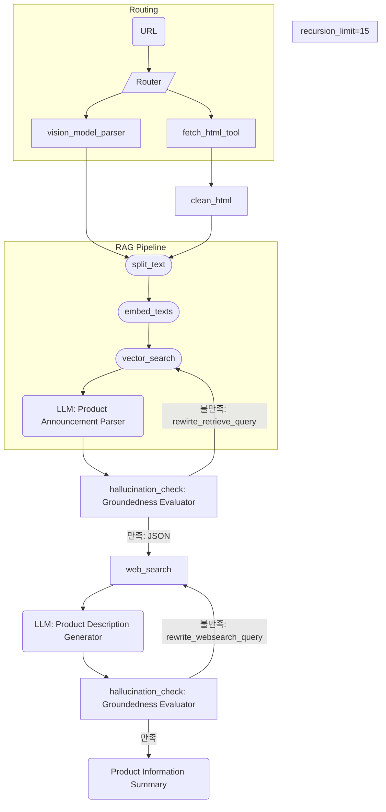
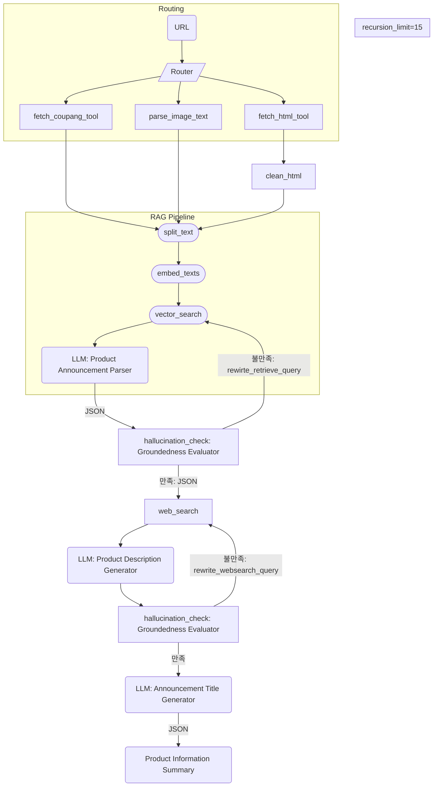
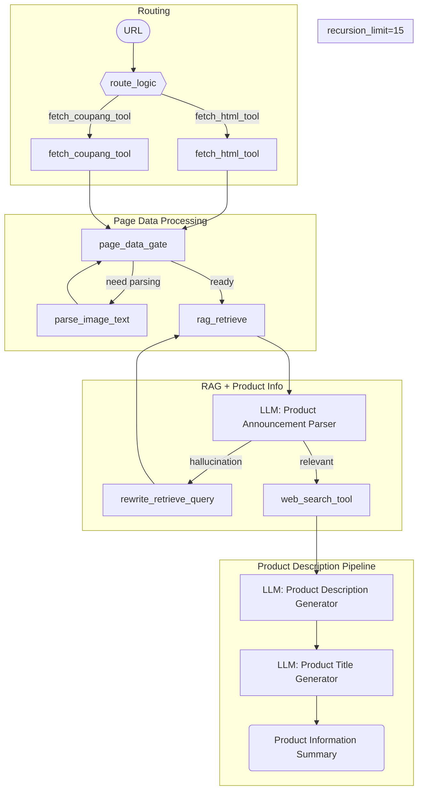

# 14-YG-AI

<details>
<summary>사용 방법</summary>

> 0. .env(env_sample) 및 gcp api key(.json) 필요

> 1. python3 -m venv venv

> 2. mac: source venv/bin/activate / win(powershell): venv/Scripts/Activate.ps1

> 3. pip install --upgrade pip (생략 가능)

> 4. pip install -r requirements.txt

> 5. python app.py
</details>

## 📘 API 명세서 - 상품 상세 설명 생성

### 🔗 **POST** `/generation/description`

---

### 📌 요청 예시
```json
{
  "url": "https://myprotein/link"
}
```

---

### 📥 요청 파라미터

| 이름       | 타입    | 필수 여부 | 설명                            |
|------------|---------|-----------|---------------------------------|
| `url`      | string  | ✅ 필수   | 상품 페이지의 URL               |

> 선택 파라미터는 없습니다.

---

### 📤 응답 형식

#### ✅ 200 OK

| 필드                       | 타입     | 설명                                                       |
|----------------------------|----------|------------------------------------------------------------|
| `message`                  | string   | 성공 메시지                                                |
| `data.product_name`        | string   | 정식 상품명                                                |
| `data.product_lower_name`  | string   | 상품명 요약 (검색용 이름)                                 |
| `data.total_price`         | number   | 총 가격 (정수, 원 단위)                                   |
| `data.count`               | number   | 총 수량                                                    |
| `data.summary`             | string   | 생성된 마케팅용 상품 설명 (이모지 포함)                  |
| `data.title`             | string   | 생성된 추천 공고 제목 (이모지 포함)                  |

📌 **응답 예시**
```json
{
    "generation": {
        "product_name": "햇반 발아현미밥, 210g, 8개",
        "product_lower_name": "햇반 발아현미밥",
        "total_price": 9400,
        "count": 8,
        "summary": "바쁜 현대인을 위한 최고의 선택! 햇반! 🍚 시간 없을 때 간편하게 즐기는 영양 만점 즉석밥! ✨\n\n특수 용기 포장으로 산소와 수분 차단!  🛡️ 방부제 없이도 안전하고 건강하게    즐길 수 있어요! 😊  찬밥, 따뜻한 밥,  취향 따라 골라 먹는 재미까지!  🍚🧊\n\n\n<br/>\n<br/>\n",
        "title": "햇반 8개 9,400원?!😲 밥 걱정 끝! 😎\n"
    }
}
```

---

### ⚠️ 에러 응답

| 상태 코드         | 설명                          | 예시 메시지                                |
|------------------|-------------------------------|--------------------------------------------|
| `400 Bad Request`| 잘못된 URL 형식                | `"유효하지 않은 URL 형식입니다."`          |
| `500 Server Error`| 서버 내부 오류 발생           | `"서버에서 오류가 발생했습니다. 잠시 후 다시 시도해주세요."` |

📌 **에러 응답 예시**
```json
// 400 Bad Request
{
  "message": "유효하지 않은 URL 형식입니다.",
  "data": null
}

// 500 Internal Server Error
{
  "message": "서버에서 오류가 발생했습니다. 잠시 후 다시 시도해주세요.",
  "data": null
}
```
---
# LangGraph
<details><summary>0502 랭그래프 아키텍처</summary>



</details>

<details><summary>0513 랭그래프 아키텍처</summary>
	


</details>

### 0519 랭그래프 아키텍처

