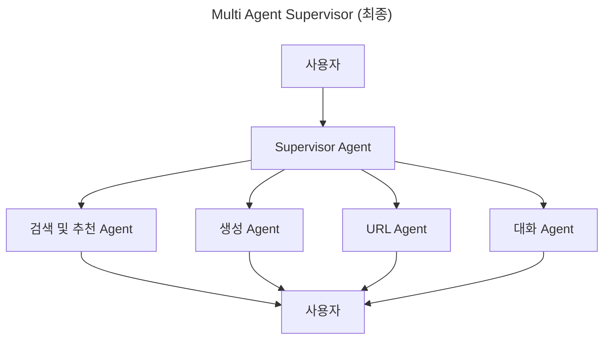

# 🛒 뭉치면 산다 챗봇 V3 - 기술 문서

> 코드 구조, 아키텍처, 및 구현 세부사항에 대한 상세 개발자 가이드

## 📋 문서 개요

이 문서는 뭉치면 산다 AI 어시스턴트 챗봇 프로젝트의 기술적 구현 세부사항을 다룹니다. 코드 구조, 각 파일의 역할, 데이터 플로우, 그리고 확장 방법에 대해 설명합니다.

**프로젝트 정보**:
- **버전**: v2.0.0
- **Python**: 3.11.11
- **주요 프레임워크**: FastAPI, LangGraph, Langfuse, MySQL, PostgreSQL, VertexAI

---

## 🏗️ 아키텍처 개요

### 전체 시스템 구조




### 레이어별 역할

1. **Client Layer**: 사용자 인터페이스 및 API 클라이언트
2. **API Layer**: HTTP 엔드포인트 및 요청/응답 처리
3. **Business Logic Layer**: 핵심 비즈니스 로직 및 세션 관리
4. **AI Workflow Layer**: LangGraph 기반 멀티 에이전트 시스템
5. **Tools Layer**: 에이전트가 사용하는 도구들
6. **Data Layer**: 데이터베이스 및 설정 관리
7. **External Services**: 외부 AI 서비스 및 모니터링

---

## 📁 상세 디렉토리 구조

```
v2/                                     # 프로젝트 루트
├── 🚀 app.py                          # [120줄] FastAPI 메인 애플리케이션
├── 📦 requirements.txt                # [24줄] Python 의존성 목록
├── 🔧 .env                            # 환경변수 (git 제외)
├── 🔧 env_sample                      # 환경변수 샘플
├── 📄 embedding_state.json            # 임베딩 상태 저장
├── 🔑 ktb-2-moongsan-*.json          # Google Cloud 서비스 계정 키
│
├── ⚙️ config/                         # 설정 관리 모듈
│   ├── 📄 __init__.py                 # [30줄] 패키지 초기화
│   └── 🔧 settings.py                 # [348줄] Pydantic 기반 통합 설정
│
├── 📡 api/                            # REST API 엔드포인트 모듈
│   ├── 📄 __init__.py                 # [25줄] 라우터 통합 관리
│   ├── 💬 chat.py                     # [393줄] 채팅 API 구현
│   └── 💊 health.py                   # [177줄] 헬스체크 API
│
├── 🎯 core/                           # 핵심 비즈니스 로직 모듈
│   ├── 👥 session.py                  # [400줄] 세션 및 메시지 관리
│   ├── 📨 message.py                  # [250줄] 메시지 처리 로직
│   └── 📡 streaming.py                # [200줄] SSE 스트리밍 처리
│
├── 🤖 workflow/                       # LangGraph 워크플로우 시스템
│   ├── 📄 __init__.py                 # [100줄] 워크플로우 시스템 초기화
│   ├── 👑 supervisor.py               # [439줄] 메인 워크플로우 상태 관리
│   ├── 🎭 agents.py                   # [360줄] 에이전트 생성 및 팩토리
│   ├── 📝 prompts.py                  # [400줄] 에이전트 프롬프트 템플릿
│   └── 🧭 routing.py                  # [350줄] 지능형 메시지 라우팅
│
├── 🔧 tools/                          # 에이전트 도구 모듈
│   ├── 🔍 search_post_tool.py         # [1129줄] 공구 검색 도구
│   ├── ✨ create_post_tool.py         # [~200줄] 공구 생성 도구
│   ├── 🔗 search_urls_tool.py         # [~150줄] URL 검색 도구
│   └── 🔄 my2pg.py                    # [~100줄] MySQL-PostgreSQL 동기화
│
├── 🛠️ utils/                          # 유틸리티 모듈
│   └── 🎨 formatting.py               # [400줄] 메시지 포맷팅 및 변환
│
├── 🌐 static/                         # 정적 파일 (임시 프론트엔드)
   └── 🎨 index.html                  # [1328줄] 웹 채팅 인터페이스
```

---

## 🚀 메인 애플리케이션 (app.py)

### 코드 분석

**파일**: `app.py` (120줄)  
**역할**: FastAPI 애플리케이션의 진입점 및 초기화

```python
# 주요 구성 요소
from fastapi import FastAPI, Depends, HTTPException
from config import settings
from api import include_all_routers
from workflow import create_supervisor_workflow, initialize_workflow_system

# 전역 워크플로우 앱
supervisor_app = None

# FastAPI 앱 생성
app = FastAPI(
    title=settings.app_name,
    version=settings.app_version,
    description=settings.description,
    debug=settings.server.debug,
)
```

### 주요 기능

1. **애플리케이션 초기화**
   ```python
   @app.on_event("startup")
   async def startup_event():
       global supervisor_app
       # 워크플로우 시스템 초기화
       init_result = initialize_workflow_system()
       # 슈퍼바이저 워크플로우 생성
       supervisor_app = create_supervisor_workflow()
   ```

2. **의존성 주입**
   ```python
   def get_supervisor_app():
       """워크플로우 앱 의존성 함수"""
       if supervisor_app is None:
           raise HTTPException(status_code=503, detail="워크플로우가 초기화되지 않았습니다")
       return supervisor_app
   ```

3. **라우터 등록**
   ```python
   # API 라우터 등록
   include_all_routers(app)
   ```

### 설계 원칙

- **의존성 주입**: `Depends()`를 통한 워크플로우 앱 주입
- **전역 상태 관리**: 단일 워크플로우 인스턴스 관리
- **에러 처리**: 초기화 실패시 명확한 에러 메시지
- **환경 분리**: 설정 기반 디버그/프로덕션 모드

---

## ⚙️ 설정 시스템 (config/settings.py)

### 코드 분석

**파일**: `config/settings.py` (348줄)  
**역할**: Pydantic 기반 타입 안전 설정 관리

### 설정 클래스 구조

```python
# 1. PostgreSQL 설정
class PostgresSettings(BaseSettings):
    host: str = os.getenv("PG_HOST")
    port: int = int(os.getenv("PG_PORT"))
    user: str = os.getenv("PG_USER")
    password: str = os.getenv("PG_PASSWORD")
    dbname: str = os.getenv("PG_DBNAME")
    vector_dimension: int = 4096  # pgvector 차원
    
    @property
    def connection_params(self) -> dict:
        """psycopg2 연결 파라미터 반환"""
        return {"host": self.host, "port": self.port, ...}

# 2. MySQL 설정
class MySQLSettings(BaseSettings):
    db_host: str = os.getenv("MYSQL_DB_HOST")
    ssh_host: str = os.getenv("MYSQL_SSH_HOST")
    # SSH 터널링 설정 포함
    
# 3. Google Cloud 설정
class GoogleCloudSettings(BaseSettings):
    project: str = os.getenv("GOOGLE_CLOUD_PROJECT")
    model_name: str = "gemini-2.0-flash"
    temperature: float = 0.7
    
    @field_validator("credentials_path")
    @classmethod
    def validate_credentials_path(cls, v):
        if not os.path.exists(v):
            raise ValueError(f"Google Cloud 인증 파일을 찾을 수 없습니다: {v}")
        return v
```

### 주요 설정 그룹

1. **데이터베이스 설정**
   - PostgreSQL (메인 DB + pgvector)
   - MySQL (레거시 DB + SSH 터널)

2. **AI 서비스 설정**
   - Google Cloud (Vertex AI)
   - Upstage (임베딩 API)
   - LangFuse (트레이싱)

3. **서버 설정**
   - FastAPI 서버 구성
   - CORS 정책
   - 세션 관리

4. **워크플로우 설정**
   - 에이전트 온도 설정
   - 검색 제한 설정